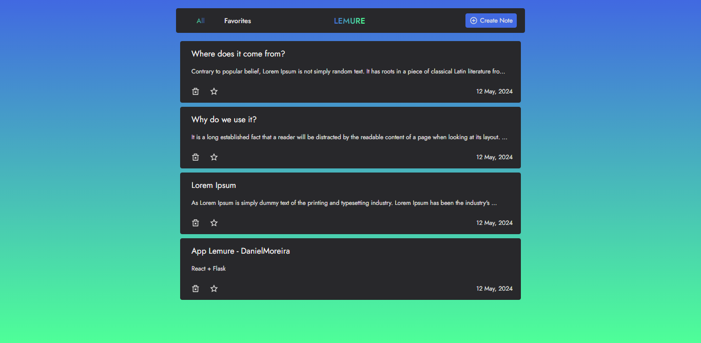

### Front-end:
React, Node.js e SASS/SCSS

- **elements**: Componentes reutilizáveis ​​(JS, SASS)
- **pages**: Layouts da aplicação (visual)

**Elements**:
Componentes JS reutilizáveis ​​para construir a interface do usuário.
Estilos SASS/SCSS para formatação visual consistente.

**Pages**:
Layouts React que definem a estrutura visual da aplicação.
Implementação de componentes reutilizáveis ​​para criar páginas dinâmicas.
Back-end:

### Back-end:
Flask e SQLite

- **main**: Configuração principal do servidor
- **routes**: Rotas API (Flask-RESTX)
- **models**: Modelos de dados (ORM, entrada HTTP)
- **instance**: Banco de dados SQLite

**Main**:
Cria e configura a instância do servidor Flask.
Define variáveis ​​ambientais e configurações de banco de dados.
Importa módulos e bibliotecas necessárias.

**Routes**:
Define rotas API utilizando o Flask-RESTX.
Implementa endpoints para CRUD (Criar, Ler, Atualizar, Excluir) operações em dados.
Valida entradas e manipula respostas HTTP.

**Models**:
Define modelos de dados utilizando ORM (Object-Relational Mapping).
Mapeia entidades do banco de dados para objetos Python.
Valida dados de entrada e saída do HTTP.

**Instance**:
Executa consultas SQL para CRUD e outras operações de dados.
Implementa lógica de persistência e recuperação de dados.